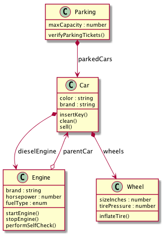

# Loopback UML Generator

I the current company I'm working where we use Loopback for most of the projects, I realise that there was a gap between production code and architecture documents.

Because keeping diagrams up-to-date can be a time consuming task, I started working on a Node.js module that will generate the UML class diagram using the famous [PlantUML](http://plantuml.com/class-diagram) Java library.

## Installation

The library is available on this [NPM repository](https://www.npmjs.com/package/loopback-uml-generator)

```bash
npm i -g loopback-uml-generator
```

The module will be installed globally.

You also need to download the (PlantUML jar executable) on your machine. 

Then, just set the environment variables `PLANTUML_JAR` as the path of the executable.

**Example:** (MacOS / Linux)

```bash
export PLANTUML_JAR="~/Documents/plantuml.jar"
```

## Usage

Once installed, just navigate into your Loopback project, and type:

```bash
lbUML <the-name-of-output-files>
```

The name argument is optional, if you don't set it, the module will use the app name and its version to generate the files (based on your `package.json` file).

Two files will be created at the root of your project:
- `*.txt`, the **PlantUML** description file
- `*.png`, the generated UML class diagram image file

## Example

Here is a quick example that shows a basic UML class diagram:

### Execution

```
Loopback-UML-Generator started...

 - PlantUML description file will be saved as UML-Generator-lb-car-1.0.0.txt
 - PlantUML image file will be saved as UML-Generator-lb-car-1.0.0.png
 - PlantUML jar used: ~/Documents/plantuml.jar
 ✓ Discovered 4 JSON model(s) in this project
 ♥ PlantUML started, please wait a few seconds...
 ✓ Done! Bye ♥
```

### Result



You might want to customise the diagram's style (colors, and so on). Just edit the generated text diagram file, with some properties, such as `skinparam monochrome`, then execute the PlantUML jar file and you're good to go.

## How it works

Based on files such as `package.json` and `server/model-config.json`, the module will scan for any JSON file present in the directories listed in `_meta/sources` property. Required fields and objects are extracted after and a formatter will create the UML description file. That's not rocket science :)

## Limitations

Currently, the module supports the following Loopback's objects:
- *classes*
- *properties*
- *remote-methods*
- *relations*

Please note that for the *relations* object, only `hasOne`, `hasMany`, and `belongsTo` types are supported.

This module is still a demo, so feel free to contribuate or report any issue! Cheers ♥